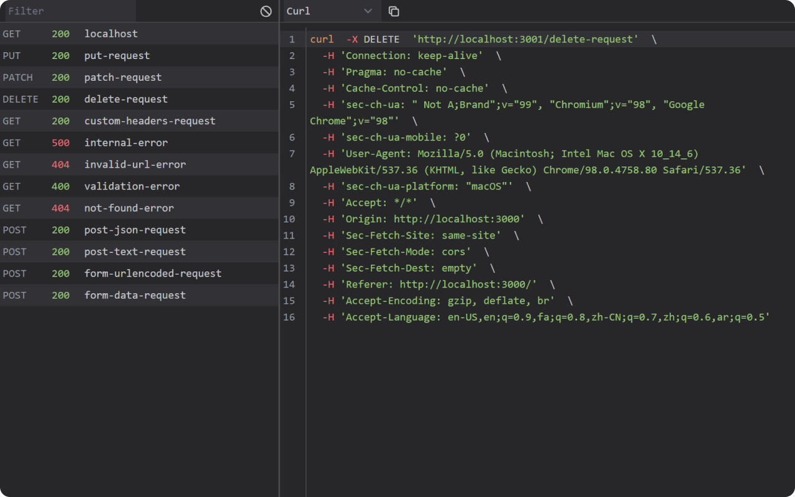

 

  

  <h3 align="center">Rektocode</h3>

  

    Chrome extension to generate code from HTTP requests
     
    <a href="https://chrome.google.com/webstore/detail/rektocode">Install</a>
    ·
    <a href="https://github.com/majidsajadi/rektocode/issues">Report Bug</a>
    ·
    <a href="https://github.com/majidsajadi/rektocode/issues">Request Feature</a>
  

 

  
  

 

**Rektocode** is a devtools extension that helps you monitor HTTP requests and convert them into other programming languages such as JavaScript, Golang, Curl, etc.
 
 

### Install

TODO

### Contributing

TODO

### License

TODO
